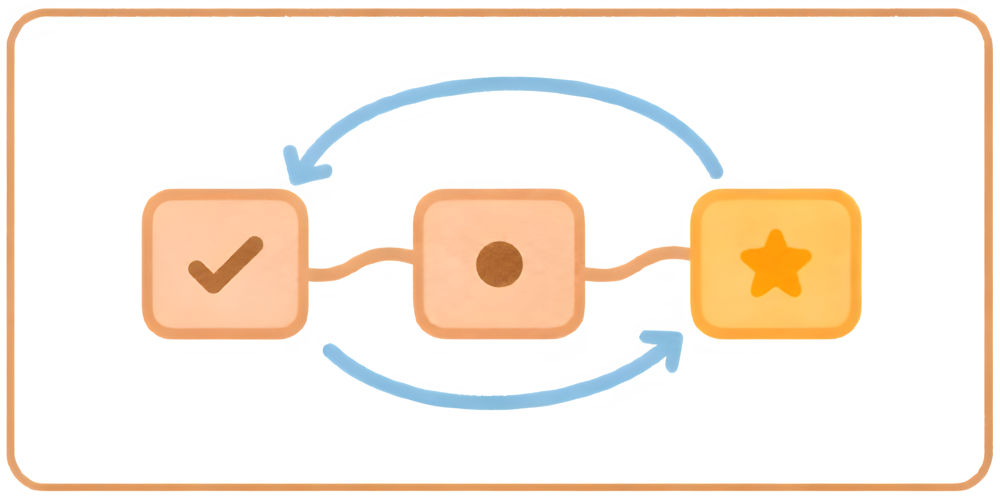

# self-replanning mode

<div align="center">
    
</div>

Replan a plan that has been planned, then plan to replan it when everything goes exactly as unplanned.

OR A skill for creating, carrying out, and replanning clear plans.

It works in a loop:

1. Understand the problem.
2. Make a plan.
3. Carry out the plan and check each step.
4. Replan all unfinished work from phase evidence, validate it, and continue.

The generated plan records current facts, open questions, task order, proof,
phase feedback, whole-future replans, and a final check against the original
request.

## Tests

```bash
python3 tests/run.py            # run
python3 tests/run.py --update   # regenerate the .stdout files
```

## Install

```bash
# Inspect the skill before installing it
npx skills add bekerk/self-replanning-mode --list

# Install interactively into the current project
npx skills add bekerk/self-replanning-mode --skill self-replanning-mode
```

